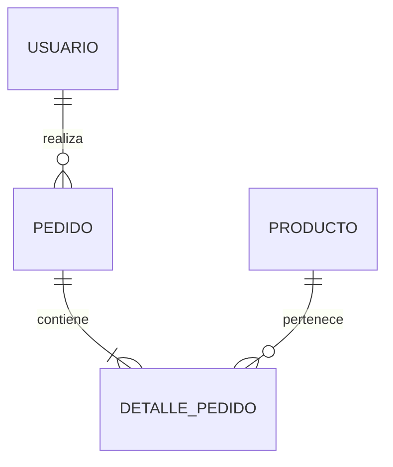

# Proyecto Inmobiliaria

Proyecto Inmobiliaria Laboratorio 2

---

## 👥 Integrantes del Grupo

- **Aldo Nehuen Zerdá** - *aldonehuen123@gmail.com* - [@NehuenZ12](https://github.com/nehuenZ12) - Discord: `usuario_discord`
- **Heber Gomez** - *heber12398@gmail.com* - [@owengmz](https://github.com/owengmz) - Discord: `usuario_discord`
- **José Gabriel Garces Brocal** - *jjoosseegg69@gmail.com* - [@josegarcesss](https://github.com/josegarcesss) - Discord: `usuario_discord`

---

## 📐 Modelado de Datos

A continuación se presenta el esquema del modelo de datos correspondiente a la aplicación:

### Diagrama Entidad-Relación (DER) / Diagrama de Clases

> **Nota:** Puedes adjuntar la imagen en el repositorio (por ejemplo, en una carpeta `/docs` o `/img`) y enlazarla como se muestra arriba, o pegar directamente un diagrama generado en Mermaid.

Ver diagrama en código Mermaid (Opcional)

